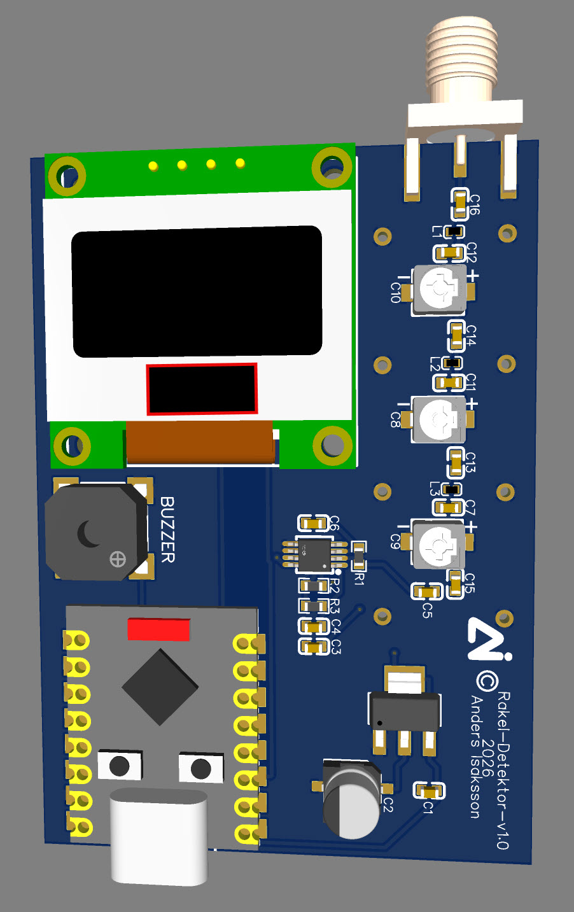
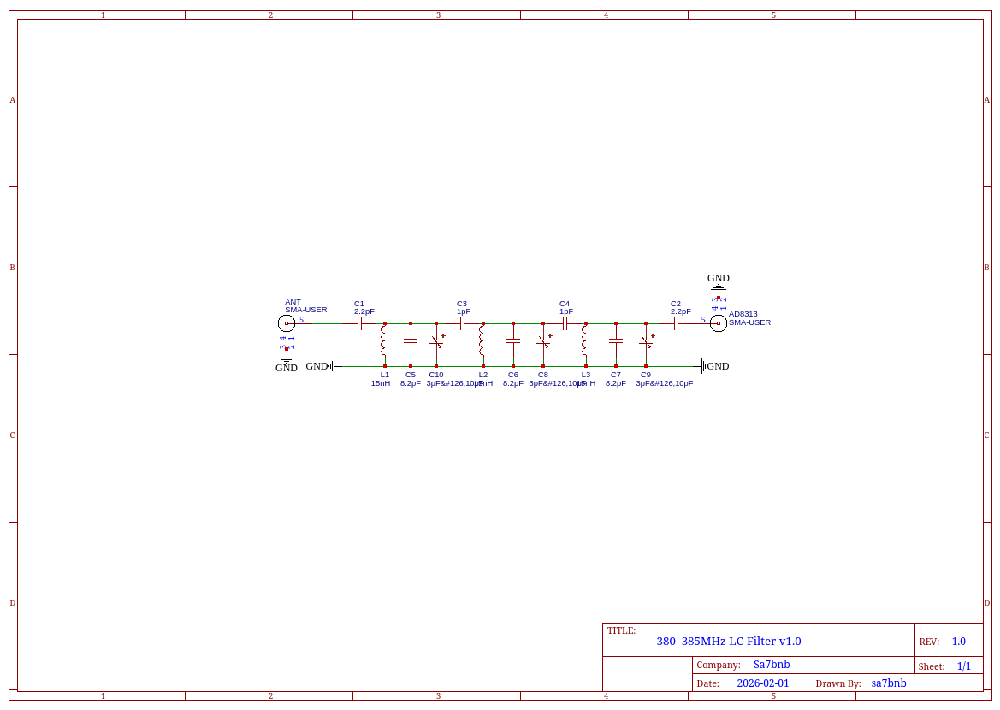
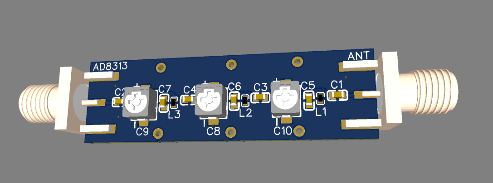
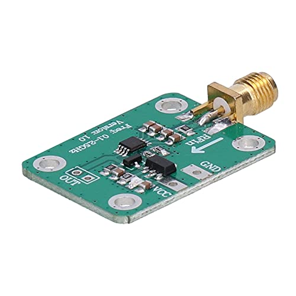

# TETRA Signal Detector (380–385 MHz)
# Rakel-Detektor-v1.0



An RF signal detector for the TETRA/Rakel frequency band based on an AD8313 logarithmic detector, a custom-built LC bandpass filter, and an ESP32-C3 microcontroller. The device provides a visual and audible alert when it detects RF activity within 380–385 MHz — the frequency range used by Rakel (Sweden's public safety network based on the TETRA standard).

> **⚠️ NOTE: This is an ongoing hobby project under active development. Nothing is finished or ready for practical use. The filter will require tuning and the entire system needs calibration. In theory and practice the concept should work, but a lot of work remains.**

---

## Purpose

The goal of this project is to build a portable device that provides an indication — via OLED display and buzzer — when you are in the vicinity of an active Rakel unit (a TETRA radio used by police, fire and rescue, and ambulance services). Think of it as a simple "RF proximity detector" for a specific frequency band.

**The device does not decode, demodulate, or interpret Rakel traffic in any way.** It functions purely as a wideband signal strength meter that reacts to RF energy within the filtered frequency range. No audio, data, identities, or protocol information can be extracted. The only thing measured is the instantaneous signal strength in dBm.

---

## System Overview

The signal chain looks like this:

```
Antenna → LC Bandpass Filter (380–385 MHz) → AD8313 (Log Detector) → ESP32-C3 (ADC) → OLED + Buzzer
```

### 1. LC Bandpass Filter (380–385 MHz)

A custom-designed and hand-built LC bandpass filter that limits the frequencies reaching the detector to 380–385 MHz. The filter is a multi-stage LC filter with three inductors and associated capacitors in a classic coupled resonator topology.

**Schematic:**



**PCB layout:**


**3D view:**



**Filter components:**

| Ref | Value | Function |
|-----|-------|----------|
| L1, L2, L3 | ~15 nH | Shunt inductors (adjustable) |
| C1, C2 | 2.2 pF | Series coupling in/out |
| C3, C4 | 1 pF | Series coupling between sections |
| C5, C7 | 8.2 pF | Shunt capacitors |
| C6 | 8.2 pF | Central shunt capacitor |
| C8, C9, C10 | 3 pF–10 pF | Trimmer capacitors for fine-tuning |

The filter is built on a custom PCB with SMA connectors on both ends (antenna side and AD8313 side). The trimmer capacitors (C8, C9, C10) allow fine-tuning of the center frequency and bandwidth after assembly.

> The filter is not perfect and will require trimming with a VNA or signal generator to achieve the desired response. It may have more insertion loss than optimal, but it should be sufficient to limit the detector to the correct frequency band.

### 2. AD8313 Logarithmic Detector



The AD8313 from Analog Devices is a logarithmic RF detector that converts RF signal strength to a DC voltage proportional to the input power in dBm.

**Key specifications:**

- Frequency range: 0.1–2.5 GHz
- Dynamic range: ~70 dB
- Logarithmic slope: ~18 mV/dB
- Intercept: ~−100 dBm (at 50 Ω)
- Supply voltage: 2.7–5.5 V (powered by 3.3 V from the ESP32)

The AD8313 module receives the filtered RF signal via SMA from the LC filter. Its VOUT pin provides a DC voltage that the ESP32's ADC reads. This voltage is then mathematically converted back to dBm in firmware.

### 3. ESP32-C3 SuperMini (Microcontroller)

A compact ESP32-C3 SuperMini module runs firmware written in the Arduino IDE. It reads the AD8313 output via its 12-bit ADC, calculates signal strength in dBm, and presents the result on the display while controlling the buzzer.

**Firmware features:**

- 32x ADC oversampling with exponential moving average (EMA) filtering
- Conversion from ADC voltage to dBm via AD8313 calibration constants
- Peak-hold with timed decay
- Session maximum tracking
- Serial output of raw data (ADC, mV, dBm) for calibration

### 4. OLED Display (SSD1306, 0.96")

A 128×64 pixel OLED connected via I2C displays:

- Current signal strength in dBm (large text)
- Bar graph with peak marker
- Signal history graph (scrolling 64-point line graph)
- Signal strength icon (bar indicator similar to mobile signal)
- Peak and session maximum values

### 5. Buzzer

A passive buzzer driven via PWM provides audible feedback:

- **No signal:** Silent
- **Weak signal (> −65 dBm):** Slow pulsing tone
- **Stronger signal:** Faster pulse and higher frequency
- **Strong signal (> −40 dBm):** Continuous high-pitched tone

---

## Wiring Diagram

```
ESP32-C3 SuperMini          Components
┌──────────────┐
│         GPIO0 ├──────────── AD8313 VOUT
│         GPIO3 ├──────────── Buzzer
│         GPIO6 ├──────────── OLED SDA
│         GPIO7 ├──────────── OLED SCL
│          3.3V ├──────────── AD8313 VPOS / OLED VCC
│           GND ├──────────── Common GND
└──────────────┘

Antenna ──► [SMA] LC Filter 380-385MHz [SMA] ──► AD8313 module ──► VOUT to GPIO0
```

---

## Arduino IDE — Getting Started

**Board:** ESP32C3 Dev Module (via the ESP32 board package)

**Libraries to install:**

- Adafruit SSD1306
- Adafruit GFX Library

**Calibration:**

The default values in the code (`AD8313_SLOPE_MV = 18.0`, `AD8313_INTERCEPT_DBM = -100.0`) are taken from the AD8313 datasheet. Each module and filter has its own characteristics. Use the serial monitor (115200 baud), which outputs `RAW_ADC, mV, dBm, Peak_dBm`, to calibrate against a known signal source.

---

## Project Status

- [x] Schematic and PCB design for the LC filter
- [x] Basic firmware with OLED, buzzer, and AD8313 readout
- [ ] Calibration against a known signal source
- [ ] LC filter tuning with a VNA
- [ ] Field testing
- [ ] Power consumption optimization
- [ ] Possible single PCB for the complete unit

---

## Disclaimer

This project is a non-commercial hobby project for educational purposes.

The device is **receive-only** and is completely incapable of transmitting radio signals. It contains no transmitter components and no firmware or hardware that enables transmission.

The device **does not decode, demodulate, decrypt, interpret, or store** radio communications. It functions solely as a wideband RF signal strength meter that produces a voltage proportional to received RF power within a filtered frequency range. No audio, data, identities, or protocol information can be extracted.

---

## License

This project is shared as open source for educational purposes. Use is entirely at your own risk.

---

*SA7BNB — 2026*
